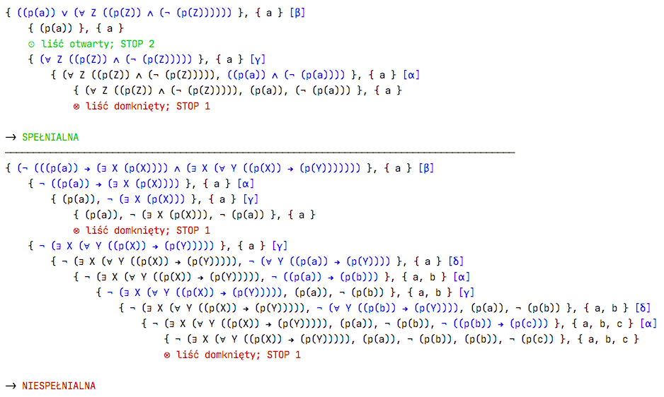

# MTS - Metoda Tablic Semantycznych
Ten program to implementacja Metody Tablic Semantycznych w Pythonie.



Na zdjęciu widoczny jest wynik programu dla pliku input zawierającego:
```
a p/1 Z Z p/1 Z p/1 NOT AND FORALL OR
a p/1 X X p/1 ∃ → X Y X p/1 Y p/1 → ∀ ∃ ∧ ¬
```

Program powstał w ramach zaliczenia przedmiotu Logika Obliczeniowa (Informatyka, I semestr, Politechnika Poznańska).
## Działanie programu
Na wejściu przyjmuje on formuły w postaci ONP (Odwróconej Notacji Polskiej), oddzielone znakami nowej linii.

Konstruując formułę należy stosować notację z pliku [MTS/notation.py](MTS/notation.py).
Wprowadzona formuła podlega normalizacji - nazwy operatorów zamieniane są na symbole.

Na wyjściu otrzymywane jest graficzne drzewo wywodu. Kolejne węzły drzewa powstające w ramach przekształceń regułami alfa/beta/delta/gamma wyświetlane są w nowych liniach, zaś poziom głębokości węzła w drzewie symbolizowany jest głębokością wcięcia.

Każdy węzeł zawiera listę formuł, dziedzinę oraz dodatkowo - wykonywaną na danym węźle przez program regułę. Formuła na której wykonana zostanie operacja jak i symbol operacji (alfa/beta/delta/gamma) podświetlane są na niebiesko.

Reguły są aplikowane w kolejności: alfa → beta → delta → gamma

Gdy w węźle występuje para literałów komplementarnych, jest to liść jest domknięty.

Gdy w węźle pozostały same literały I/LUB formuły typu gamma aktywowane już dla każdego elementu dziedziny, jest to liść jest otwarty.

Gdy w drzewie występuje co najmniej jeden liść otwarty, badana formuła jest spełnialna.

Gdy w drzewie występują same liście domknięte, badana formuła jest niespełnialna.

W programie nie jest zaimplementowany mechanizm przerywania następujących na zmianę w nieskończoność reguł gamma/delta.

## Instalacja
1. Przejdź w terminalu do katalogu z własnymi projektami.
2. Sklonuj to repozytorium: `git clone https://github.com/srflp/MTS`
3. Wejdź do nowo utworzonego folderu z projektem: `cd MTS`
4. Zainstaluj wymagane biblioteki: `pip install -r requirements.txt` (wymagana jest biblioteka „colorama” do kolorowania tekstu w konsoli)
5. Gotowe! Teraz uruchom program, przekazując na standardowe wejście plik input: `cat input | python3 main.py`

## Bibliografia
- [T. Łukaszewski, Logika obliczeniowa w przykładach (.pdf)](http://www.cs.put.poznan.pl/tlukaszewski/files/LogikaZadania.pdf)
- M. Ben-Ari, Logika matematyczna w informatyce, WNT,
Warszawa 2005
- [J. Józefowska, Metoda tablic semantycznych (prezentacja .pdf)](http://www.cs.put.poznan.pl/jjozefowska/wyklady/lo/W4_MTS__handouts.pdf)

